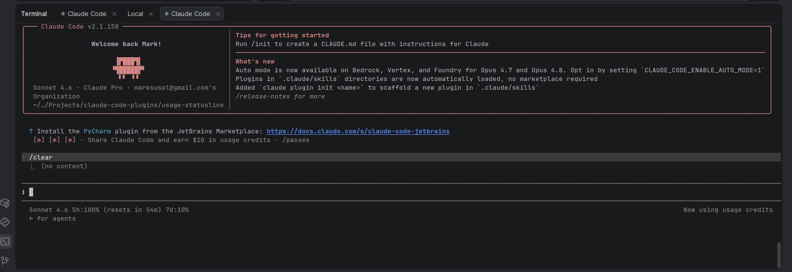

# claude-code-plugins

Personal collection of [Claude Code](https://claude.ai/code) plugins.

## Plugins

| Plugin | Description |
|--------|-------------|
| [usage-statusline](usage-statusline/) | Status line showing model, context %, and subscription rate limits |

## Usage

Clone the repo anywhere, then run the plugin's `install.sh`:

```bash
git clone https://github.com/marksusol/claude-code-plugins.git
cd claude-code-plugins/usage-statusline
bash install.sh
```

To remove a plugin:

```bash
bash uninstall.sh
```

## usage-statusline



Shows in the Claude Code status bar:

```
Claude Sonnet 4.6 | ctx:12% | 5h:34% 7d:8%
```

- **Model** — active model name
- **ctx** — context window used this turn
- **5h / 7d** — subscription rate limits used (appear after first API response)

## Known Limitations

The `statusLine` command renders per-conversation context, not at CLI startup. It will appear after the first message or `/new` — not at the initial prompt. This is a Claude Code CLI limitation.

A feature request for a `Startup` hook event has been filed:
[anthropics/claude-code#64018 — add startup/session-init hook event to settings.json hooks](https://github.com/anthropics/claude-code/issues/64018)
