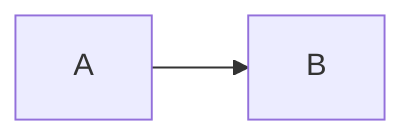

# Markdown diagrams

When a diagram is needed in a markdown file, use a fenced Mermaid code block instead of hand-drawn ASCII art.

## Rules

- Use fenced `mermaid` code blocks for architecture diagrams (`flowchart`/`graph`), sequence diagrams (`sequenceDiagram`), and entity/data-model sketches (`erDiagram`).
- Prefer Mermaid over ASCII boxes-and-arrows even for simple diagrams — it renders natively on GitHub and in most markdown viewers, and is far easier to edit than realigning ASCII art after every change.
- Inline, single-line notation embedded in prose (e.g. `A -> B -> C` inside a sentence) does not need a full Mermaid block.
- If a diagram genuinely doesn't fit any Mermaid diagram type, use a plain image (SVG/PNG) checked into the same `docs/` directory as the markdown file, not ASCII art.
- Existing ASCII diagrams in older docs may be converted opportunistically; there's no need to backfill everything at once.

## Example

Bad:

```
┌────────┐     ┌────────┐
│   A    │────►│   B    │
└────────┘     └────────┘
```

Good:

````markdown

````
